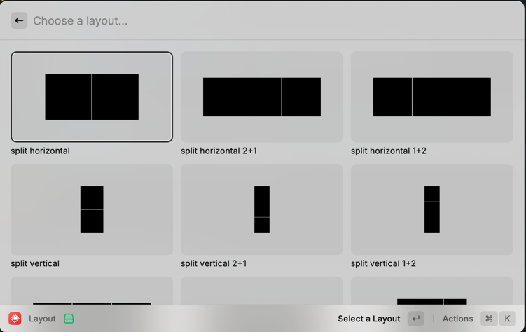
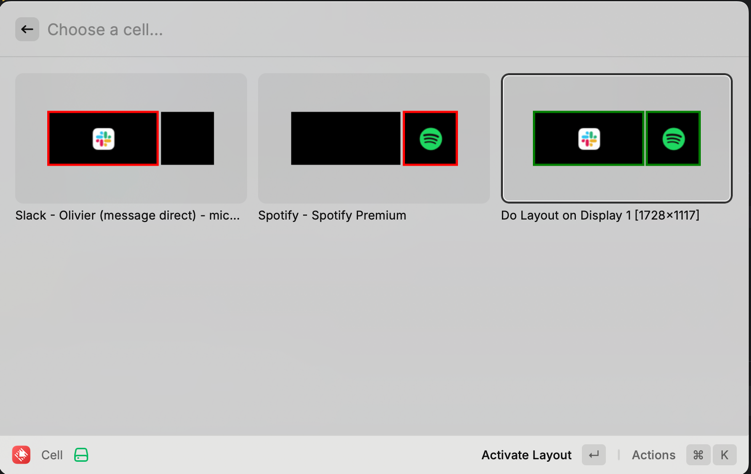

# Raycast Window Layout manager




### Installation
```
brew install swift
npm run build-window-manager
npm install && npm run dev
```

### Todo
- [ ] Filter out other selected windows on window selection
- [x] Display icons
